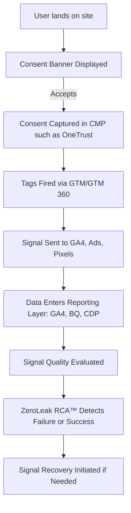
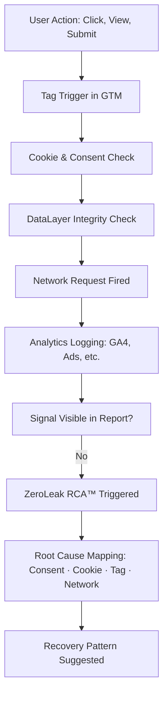

# 🧭 Architecture Overview — ZeroLeak RCA™

> A high-level walkthrough of how signals flow — and silently fail — in real-world systems, and how ZeroLeak RCA™ detects and recovers them.

---

## 🎯 CXO Summary

In today’s signal economy, every click, view, and submit triggers a cascade of logic across consent tools, tag managers, cookies, and analytics systems. When this logic fails silently — due to misfired tags, blocked scripts, or missing user IDs — it breaks attribution, erodes trust, and loses revenue.

ZeroLeak RCA™ brings **real-time traceability** and **root cause intelligence** to this invisible battlefield.

---

## 🔄 ZeroLeak RCA™ Flow: Consent to RCA

---

## 🔍 Signal RCA Trigger Flow (Failure Detected)

---

## 🧱 Layer Mapping

| Stage | Layer |
|-------|-------|
| Consent Banner | UX / Browser |
| CMP + Consent Mode | Compliance Layer |
| GTM + Tags | Signal Execution Layer |
| Network + Cookies | Transport Layer |
| GA4 + CDP | Analytics Layer |
| RCA System | Intelligence & Recovery |

---

## 🧠 Why This Matters

- Shows **where** signals break and **why**
- Helps **CxOs** map signal failures to lost revenue
- Equips **architects** to build leak-proof systems
- Turns debugging into **strategic system design**

---

## 💡 Bonus Insight

“The most expensive leaks don’t show up in your error logs.  
They hide in your attribution, trust, and consent pipelines.”

---

## 📁 Location

This architecture is visualized as both live Mermaid code (above) and downloadable PNGs inside:

`/visuals/architecture/`

For diagram variants, check:  
`/use-cases/10-zero-leak/RCA-01/visuals/`
