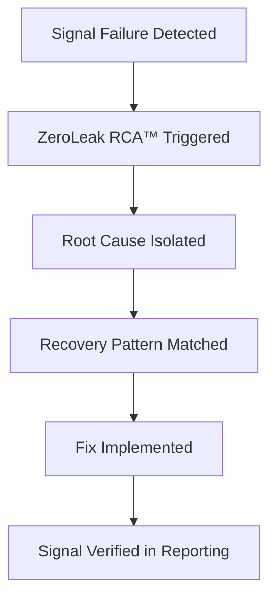

# 🔄 Signal Recovery Playbook — ZeroLeak RCA™

A tactical playbook for recovering signal integrity across GTM, GA4, and consent-driven environments.  
Built on real-world RCA loops, this guide walks teams through identifying, diagnosing, and recovering from signal losses that traditional QA misses.

---

## 🧭 Why This Playbook Matters

In privacy-constrained, multi-vendor stacks, signals drop silently — costing attribution accuracy, remarketing performance, and business trust.

This playbook provides **actionable logic and recovery steps**, not generic advice.

---

## 🧩 Core Recovery Scenarios

| Scenario | RCA Recovery Insight |
|----------|----------------------|
| Tag fired before consent | Delay tag or use Consent Mode triggers (e.g., `ad_storage`) |
| Cookie mismatch on subdomains | Sync client ID via linker config or use a shared domain cookie strategy |
| DataLayer event missing value | Redesign push logic with validation; fallbacks or defaults |
| Wrong trigger on thank-you page | Restrict by formSubmit or pagePath+referrer logic |
| Pixel fires but captures empty data | Validate payload structure; check attribute bindings |
| Ads vs GA4 mismatch | Audit `send_to` values; unify conversion tracking configuration |

---

## 🛠️ Tools to Apply Fixes

- **GTM Preview + Debug Mode** — Validate tag sequencing and trigger paths
- **Chrome DevTools: Network tab** — Inspect pixel payloads, request headers
- **Consent platform logs (e.g., OneTrust)** — Confirm status and triggers
- **Real-time GA4 reports** — Observe live hits, dimensions, mismatches
- **GTM/GA4 JS Recipes** — For conditional tagging, cookie reading, fallback logic

---

## 🧠 Recovery Mindset

- RCA is **not bug fixing** — it’s **system clarity restoration**
- Recoveries must be **predictable**, **auditable**, and **non-intrusive**
- Each recovery should be paired with a **diagram and before-after signal map**

---

## 📌 Diagram: RCA to Recovery

---

## ✅ Final Notes

This playbook grows with each RCA loop. Every new recovery strengthens the signal spine of your stack.

> “The best signal systems don’t just detect — they recover intelligently.”
