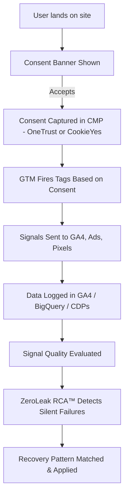
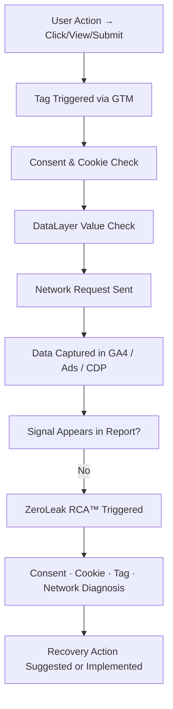

# 🧠 ZeroLeak RCA™ Framework

This document explains the **ZeroLeak RCA™** methodology — a system-resilient framework for tracing, understanding, and resolving digital signal failures across consent, cookies, tags, and network layers.

---

## 🔄 RCA Lifecycle Flow

---

## 🔍 RCA Depth Flow (From User to Signal Recovery)

---

## 🛠️ Why This Framework

- Tags may fire, but **signals may silently drop** due to consent, cookie, or dataLayer gaps.
- Traditional QA checks often **miss root-cause chains** behind broken journeys or misattributed conversions.
- ZeroLeak RCA™ introduces a **multi-layered, system-first debugging model**.

---

## 💎 Key Features

- Consent-respecting and signal-aware
- Cross-layer (CMP → GTM → GA4 → BigQuery → Report)
- Business-resonant RCA — connects tech to impact
- Designed for analysts, engineers, and growth leaders
- Pluggable into existing QA & audit ecosystems

---

## 📌 Outputs

- Architecture Diagram (Mermaid → PNG)
- Root Cause → Signal Path Mapping
- Leadership RCA Summary
- Monetization Risk View
- Persona & Industry Impact Snapshot
- Recovery Checklist & Verification Logic

---

> “We don’t debug tags. We repair truth.”
